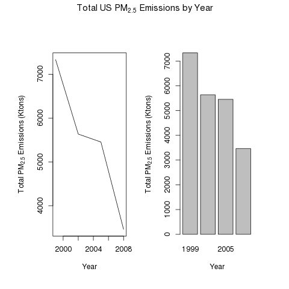
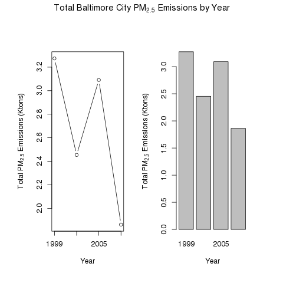
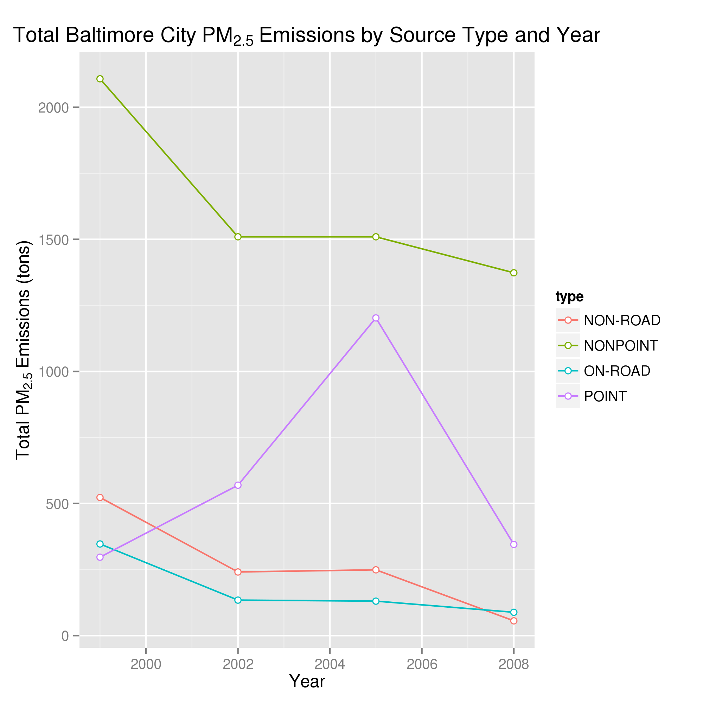

Assignment 2
---------------

## Questions

You must address the following questions and tasks in your exploratory analysis. For each question/task you will need to make a single plot. Unless specified, you can use any plotting system in R to make your plot.

1. 
Have total emissions from $PM_{2.5}$ decreased in the United States from 1999 to 2008? Using the **base** plotting system, make a plot showing thetotal $PM_{2.5}$ emission from all sources for each of the years 1999, 2002, 2005, and 2008.

 

2. 
Have total emissions from $PM_{2.5}$ decreased in the **Baltimore City**, Maryland (``fips == "24510"``) from 1999 to 2008? Use the base plotting system to make a plot answering this question.

 

3. 
Of the four types of sources indicated by the ``type`` (point, nonpoint, onroad, nonroad) variable, which of these four sources have seen decreases in emissions from 1999-2008 for **Baltimore City**? Which have seen increases in emissions from 1999-2008? Use the **ggplot2** plotting system to make a plot answer this question.

 

4. 
Across the United States, how have emissions from coal combustion-related sources changed from 1999-2008?

 

5. 
How have emissions from motor vehicle sources changed from 1999-2008 in **Baltimore City**?

 

6. 
Compare emissions from motor vehicle sources in Baltimore City with emissions from motor vehicle sources in **Los Angeles County**, California (``fips == "06037"``). Which city has seen greater changes over time in motor vehicle emissions?

 

